# Architecture

Oryn's architecture is designed around a core insight: **the scanner is the source of truth**. All HTML understanding happens in JavaScript inside the browser; the Rust layer never parses HTML directly.

## System Layers


## Agent Layer

AI agents communicate with Oryn using the Intent Language. They receive observations, make decisions, and issue commands. Agents never interact with raw browser APIs or HTML.

**Key Properties:**
- Token-efficient command syntax
- Semantic observations instead of raw HTML
- Multi-level abstraction (direct, semantic, intent)

## Protocol Layer

### Intent Parser

Interprets agent commands with forgiveness for variations:
- Case-insensitive commands
- Multiple quote styles
- Command aliases (e.g., `goto` = `navigate` = `go to`)
- Flexible option syntax

### Intent Engine

Transforms high-level intents into atomic operations:
- Built-in intents (login, search, accept_cookies, etc.)
- Loaded intents from YAML definitions
- Multi-step execution with error handling
- Success/failure verification

### Semantic Resolver

Translates targets to concrete elements:
- Text matching (`"Sign in"`)
- Role matching (`email`, `password`, `submit`)
- Pattern references (`login_form.email`)
- Fallback chains

## Backend Layer

### Backend Trait

A unified Rust trait that all backends implement:

```rust
pub trait Backend {
    async fn launch(&mut self) -> Result<(), BackendError>;
    async fn navigate(&mut self, url: &str) -> Result<NavigationResult, BackendError>;
    async fn execute_scanner(&mut self, cmd: ScannerAction) -> Result<ScannerProtocolResponse, BackendError>;
    async fn screenshot(&mut self) -> Result<Vec<u8>, BackendError>;
    async fn close(&mut self) -> Result<(), BackendError>;
}
```

This abstraction ensures agents can switch modes without changing their logic.

### oryn-h (Headless)

- **Technology**: Chrome DevTools Protocol (CDP)
- **Transport**: WebSocket
- **Library**: chromiumoxide
- **Best for**: Cloud automation, CI/CD, maximum compatibility

### oryn-e (Embedded)

- **Technology**: WebDriver protocol
- **Transport**: HTTP
- **Library**: fantoccini
- **Best for**: IoT, containers, low-memory environments

### oryn-r (Remote)

- **Technology**: Custom WebSocket protocol
- **Transport**: WebSocket
- **Client**: Browser extension
- **Best for**: User assistance, authenticated sessions, debugging

## Scanner Layer

The Universal Scanner is a JavaScript module injected into all browser contexts:

```javascript
// Simplified scanner interface
const scanner = {
  scan: () => { /* Returns all interactive elements */ },
  click: (id) => { /* Clicks element by ID */ },
  type: (id, text) => { /* Types into element */ },
  // ... more commands
};
```

**Key Properties:**
- Byte-for-byte identical across all backends
- JSON request/response protocol
- Maintains element map for efficient targeting
- Detects UI patterns automatically

## Data Flow

### Command Execution

```mermaid
sequenceDiagram
    participant Agent
    participant Parser
    participant Engine
    participant Backend
    participant Scanner
    participant Browser

    Agent->>Parser: click "Sign in"
    Parser->>Engine: ClickCommand(text="Sign in")
    Engine->>Backend: observe()
    Backend->>Scanner: {action: "scan"}
    Scanner->>Browser: Query DOM
    Browser-->>Scanner: Element data
    Scanner-->>Backend: {status: "ok", elements: [...]}
    Backend-->>Engine: Elements list
    Engine->>Engine: Resolve "Sign in" → ID 5
    Engine->>Backend: click(5)
    Backend->>Scanner: {action: "click", id: 5}
    Scanner->>Browser: Click element
    Browser-->>Scanner: Success
    Scanner-->>Backend: {status: "ok", success: true}
    Backend-->>Engine: Success
    Engine-->>Parser: ClickResult
    Parser-->>Agent: ok click [5]
```



### Observation Flow


## Design Principles

### Scanner as Source of Truth

> **HTML parsing should NOT happen in Rust.**

If HTML were parsed differently per backend, behavior would diverge. The Universal Scanner eliminates this risk by ensuring all DOM understanding happens in JavaScript.

### Consistency Goals

Given the same page state and the same command:
- Oryn aims for equivalent semantics across `oryn-e`, `oryn-h`, and `oryn-r`.
- Minor backend/runtime differences can still appear (timing, browser engine quirks, feature support).
- Treat [Command Coverage](../reference/command-coverage.md) as the implementation authority for unified CLI support.

### Separation of Concerns

| Layer | Responsibility |
|-------|----------------|
| Agent | Decision-making, goal pursuit |
| Protocol | Command parsing, intent execution |
| Backend | Browser communication |
| Scanner | DOM understanding, element classification |
| Browser | HTML rendering, JavaScript execution |

## Resource Comparison

| Mode | RAM | Binary Size | Notes |
|------|-----|-------------|-------|
| oryn-h | ~300MB+ | ~15MB | Chrome installed separately |
| oryn-e | ~50MB | ~15MB | WPE WebKit libraries |
| oryn-r | Zero server | ~15MB | Runs in user's browser |
