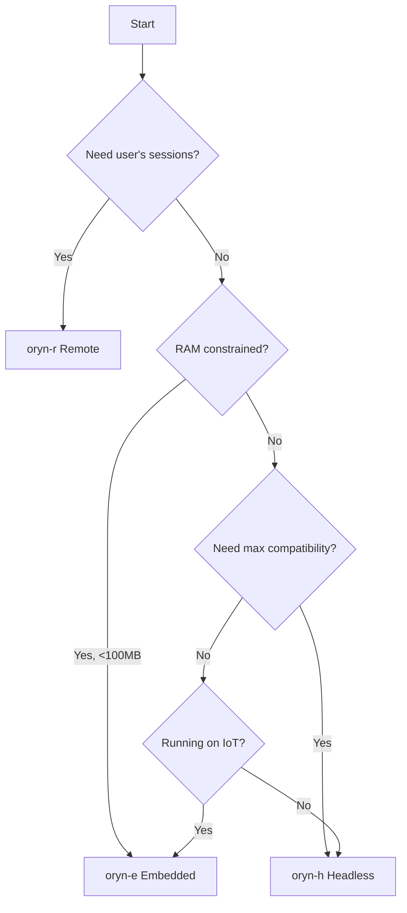

# Backend Modes

Oryn provides three deployment modes, each optimized for different environments while sharing the same protocol and behavior.

## Mode Comparison

| Aspect | oryn-e (Embedded) | oryn-h (Headless) | oryn-r (Remote) |
|--------|-------------------|-------------------|-----------------|
| **Browser Engine** | WPE WebKit | Chromium | User's Browser |
| **Protocol** | WebDriver (HTTP) | CDP (WebSocket) | Custom (WebSocket) |
| **RAM Usage** | ~50MB | ~300MB+ | Zero (client-side) |
| **Compatibility** | ~95% (WebKit) | ~99% (Chromium) | ~99% |
| **Anti-Bot Bypass** | Weak | Medium | Strong |
| **Best For** | IoT, containers | Cloud, CI/CD | User assistance |

## oryn-e: Embedded Mode

```bash
oryn embedded --driver-url http://localhost:8080
```

### Technology Stack

- **Browser**: COG (WPE WebKit)
- **Protocol**: WebDriver over HTTP
- **Library**: fantoccini (Rust WebDriver client)

### Best For

- Raspberry Pi and IoT devices
- Resource-constrained containers
- Alpine Linux deployments
- Edge computing scenarios
- Environments where RAM is precious

### Characteristics

| Property | Value |
|----------|-------|
| Memory footprint | ~50MB |
| Web compatibility | ~95% (WebKit) |
| Anti-bot effectiveness | Weak (recognizable fingerprint) |
| Self-contained | Yes (with WPE libraries) |

### Setup

```bash
# Ubuntu/Debian
sudo apt install cog libwpewebkit-1.0-dev

# Start COG in WebDriver mode
cog --webdriver --port 8080

# Connect Oryn
oryn embedded --driver-url http://localhost:8080
```

### Use Cases

**IoT Automation Hub**
```
A Raspberry Pi runs automation agents that need web access.
With ~50MB footprint, plenty of resources remain for the agent itself.
```

**Edge Retail Kiosk**
```
An in-store kiosk provides voice-controlled web browsing.
Self-contained deployment without Chrome dependency.
```

## oryn-h: Headless Mode

```bash
oryn headless
```

### Technology Stack

- **Browser**: Chromium (headless)
- **Protocol**: Chrome DevTools Protocol (CDP)
- **Library**: chromiumoxide (Rust CDP client)

### Best For

- Cloud-based automation
- CI/CD pipeline testing
- High-volume web scraping
- Complex SPA interaction
- Maximum browser compatibility

### Characteristics

| Property | Value |
|----------|-------|
| Memory footprint | ~300MB+ |
| Web compatibility | ~99% (Chromium) |
| Anti-bot effectiveness | Medium (detectable fingerprint) |
| Network interception | Yes |
| DevTools integration | Yes |

### Setup

```bash
# Install Chrome/Chromium
sudo apt install chromium-browser

# Run Oryn (auto-detects Chrome)
oryn headless

# Or specify Chrome path
oryn headless --chrome-path /usr/bin/google-chrome
```

### Options

| Option | Description |
|--------|-------------|
| `--chrome-path <PATH>` | Path to Chrome executable |
| `--user-data-dir <DIR>` | Chrome user data directory |
| `--no-headless` | Run with visible browser window |
| `--window-size <WxH>` | Browser window size |
| `--disable-gpu` | Disable GPU acceleration |

### Use Cases

**Cloud Scraping Service**
```
A system monitors competitor pricing across multiple sites.
Headless Chrome handles complex SPAs reliably.
Network interception captures API responses for analysis.
```

**CI/CD Testing**
```
Automated tests run against a web application.
Screenshots document any failures.
Same browser as production users ensures compatibility.
```

## oryn-r: Remote Mode

```bash
oryn remote --port 9001
```

### Technology Stack

- **Browser**: User's own browser
- **Protocol**: Custom WebSocket
- **Client**: Browser extension

### Best For

- User assistance workflows
- Demonstrations and teaching
- Tasks requiring authenticated sessions
- Anti-bot bypass (real browser fingerprint)
- Interactive agent assistance

### Characteristics

| Property | Value |
|----------|-------|
| Memory footprint | Zero (server-side) |
| Web compatibility | ~99% (user's browser) |
| Anti-bot effectiveness | Strong (real browser) |
| User sessions | Yes (access to logged-in state) |
| Visual feedback | Yes (user sees actions) |

### Setup

1. **Install the browser extension:**
   - Chrome: Load unpacked from `extension/` directory
   - Firefox: Load temporary add-on from `extension/`

2. **Start the remote server:**
   ```bash
   oryn remote --port 9001
   ```

3. **Connect from browser:**
   - Click the Oryn extension icon
   - Enter the server address (e.g., `localhost:9001`)
   - Click "Connect"

### Options

| Option | Description |
|--------|-------------|
| `--port <PORT>` | WebSocket server port |
| `--host <HOST>` | Host to bind to |

### Use Cases

**Personal Assistant**
```
An agent helps a user book travel.
Agent has access to user's authenticated sessions.
User watches agent navigate booking sites.
Real browser fingerprint bypasses anti-bot measures.
```

**Interactive Debugging**
```
Developer watches agent interact with their app.
Can intervene if agent gets stuck.
See exactly what the agent "sees" in real-time.
```

## Choosing a Mode

### Decision Flowchart



### Quick Reference

| Scenario | Recommended Mode |
|----------|------------------|
| Cloud automation | oryn-h |
| CI/CD testing | oryn-h |
| Web scraping | oryn-h |
| Raspberry Pi | oryn-e |
| Docker container (minimal) | oryn-e |
| Edge computing | oryn-e |
| User assistance | oryn-r |
| Authenticated sessions | oryn-r |
| Anti-bot bypass | oryn-r |
| Debugging | oryn-r |

## Protocol Consistency

All three modes share:

- Same Intent Language commands
- Same observation format
- Same element IDs and targeting
- Same error codes and responses
- Same Universal Scanner

**Guarantee:** Given the same page state and command, all three modes produce identical results.

### Limitations by Mode

**oryn-e:**
- WebKit may render some pages differently
- Some cutting-edge features may lag Chromium
- WebDriver has performance overhead

**oryn-h:**
- Headless Chrome has detectable fingerprint
- Higher resource requirements
- Chrome must be installed separately

**oryn-r:**
- Requires user to install extension
- User's browser must remain open
- Network dependent (WebSocket)
- Cannot operate unattended
