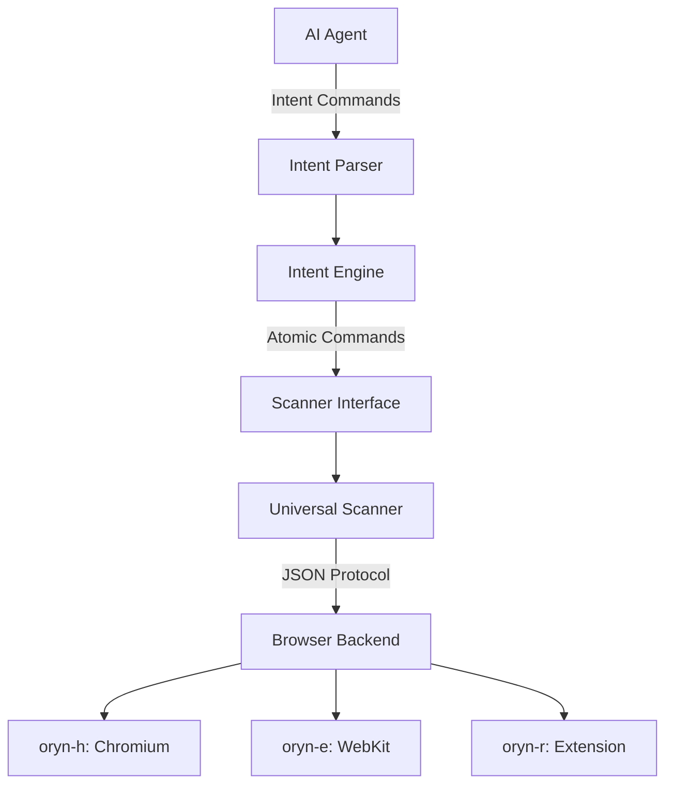

# Concepts

This section covers the core concepts and architecture of Oryn.

## Overview

Oryn is built on several key principles:

1. **Intent Over Implementation** — Agents express what they want to do, not how to do it
2. **Semantic Abstraction** — Web pages are presented as structured, labeled interactive surfaces
3. **Consistency by Design** — Shared scanner/runtime model across deployment modes
4. **Progressive Intelligence** — From atomic commands to high-level intents

## Core Components

## Key Concepts

-   :material-layers:{ .lg .middle } **Architecture**

    ---

    How Oryn's layered architecture separates agent concerns from browser complexity.

    [:octicons-arrow-right-24: Architecture](architecture.md)

-   :material-text-box:{ .lg .middle } **Intent Language**

    ---

    The agent-facing command protocol designed for token efficiency and forgiveness.

    [:octicons-arrow-right-24: Intent Language](intent-language.md)

-   :material-magnify-scan:{ .lg .middle } **Scanner Protocol**

    ---

    The internal JSON protocol between Oryn and the browser-embedded scanner.

    [:octicons-arrow-right-24: Scanner Protocol](scanner-protocol.md)

-   :material-cog:{ .lg .middle } **Intent Engine**

    ---

    How high-level intents are expanded into atomic operations.

    [:octicons-arrow-right-24: Intent Engine](intent-engine.md)

-   :material-server:{ .lg .middle } **Backend Modes**

    ---

    The three deployment modes: embedded, headless, and remote.

    [:octicons-arrow-right-24: Backend Modes](backend-modes.md)

## The Universal Scanner

At the heart of Oryn is the Universal Scanner—a JavaScript module that runs inside web pages and understands them the way agents need to.

The scanner:
- Identifies all interactive elements
- Labels them with simple numeric IDs
- Classifies their types (input, button, link, etc.)
- Infers their roles (email, password, search, submit)
- Reports their states (required, disabled, checked)
- Detects common patterns (login forms, search boxes, pagination)

This same scanner code runs in all environments, which improves cross-mode consistency while still allowing backend-specific differences.

## Multi-Level Abstraction

Oryn supports commands at different levels of abstraction:

| Level | Description | Example |
|-------|-------------|---------|
| **Level 1: Direct** | Operate on element IDs | `click 5` |
| **Level 2: Semantic** | Operate on roles/text | `click "Sign in"` |
| **Level 3: Intent** | High-level workflows | `login "user" "pass"` |
| **Level 4: Goal** | Natural language goals | (Agent/LLM layer) |

Agents can mix levels as needed, using direct commands for precision and intents for common workflows.
