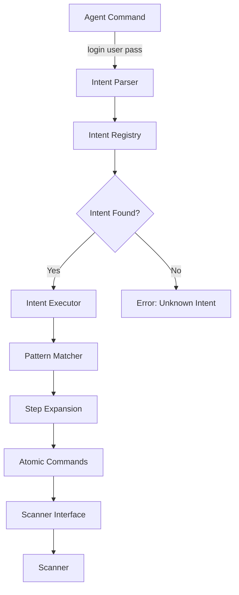
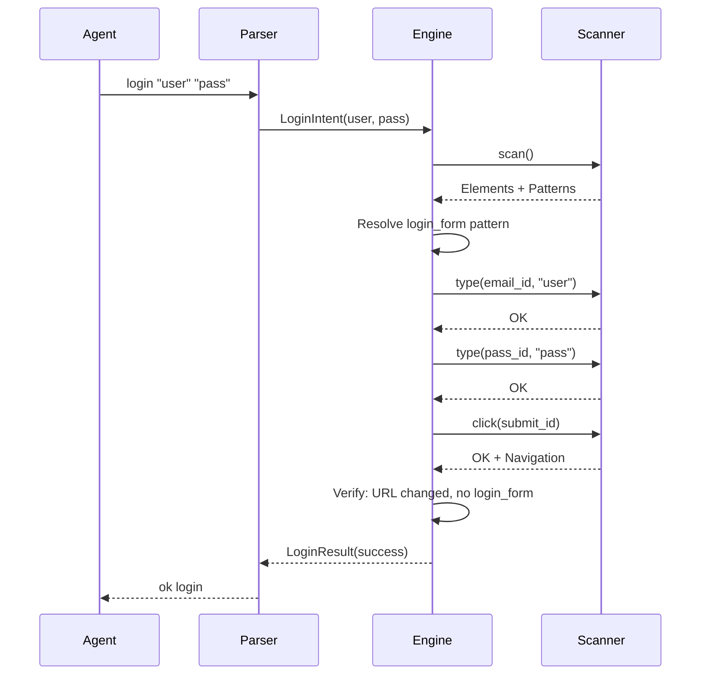

# Intent Engine

The Intent Engine is the intelligence layer of Oryn that transforms high-level agent commands into executable atomic operations.

## Core Principle

> **The scanner remains simple; the engine provides intelligence.**

The Universal Scanner knows only atomic commands: `scan`, `click`, `type`, `select`. It has no concept of "login" or "checkout." The Intent Engine holds this knowledge, expanding intent commands into sequences of atomic operations.

## Architecture



## Intent Tiers

### Tier 1: Built-in Intents

Compiled into the Rust binary, extensively tested:

| Intent | Description | Syntax |
|--------|-------------|--------|
| `login` | Authenticate with credentials | `login <user> <pass>` |
| `logout` | End authenticated session | `logout` |
| `search` | Submit search query | `search <query>` |
| `accept_cookies` | Dismiss cookie banner | `accept_cookies` |
| `dismiss_popups` | Close modal dialogs | `dismiss_popups` |
| `fill_form` | Fill multiple fields | `fill_form <data>` |
| `submit_form` | Submit current form | `submit_form` |
| `scroll_to` | Scroll element into view | `scroll_to <target>` |

### Tier 2: Loaded Intents

Defined in YAML files, loaded at startup:

| Source | Path | Description |
|--------|------|-------------|
| Core | `intents/core/*.yaml` | Common intents shipped with Oryn |
| Site Packs | `intents/packs/{domain}/*.yaml` | Site-specific intents |
| User | `~/.oryn/intents/*.yaml` | User-defined intents |

### Tier 3: Discovered Intents

Created by learning during operation, session-scoped by default.

## Execution Pipeline



### Pipeline Stages

| Stage | Description |
|-------|-------------|
| **Parse** | Extract intent name and parameters |
| **Resolve** | Look up intent definition |
| **Plan** | Scan page, resolve targets, generate steps |
| **Execute** | Run each step, collect results |
| **Verify** | Check success/failure conditions |
| **Respond** | Format response for agent |

## Intent Definition Format

Intent definitions use YAML:

```yaml
intent: login
version: "1.0"
description: "Authenticate with username/email and password"

parameters:
  - name: username
    type: string
    required: true
  - name: password
    type: string
    required: true

steps:
  - action: type
    target: { role: email }
    text: $username

  - action: type
    target: { role: password }
    text: $password

  - action: click
    target: { role: submit }

  - action: wait
    condition:
      any:
        - url_changed: true
        - pattern_gone: login_form

success:
  conditions:
    - url_changed: true
    - pattern_gone: login_form

failure:
  conditions:
    - text_contains: ["incorrect", "invalid", "wrong"]
```

## Target Resolution

Targets can be specified multiple ways:

```yaml
# By pattern reference
target:
  pattern: login_form.email

# By role
target:
  role: email

# By text
target:
  text: "Sign in"
  match: contains

# By selector (fallback)
target:
  selector: "#email-input"

# With fallback chain
target:
  pattern: login_form.submit
  fallback:
    role: submit
    fallback:
      text_contains: ["sign in", "log in"]
```

### Resolution Algorithm

```
1. Pattern reference → Pattern detected? → Get element ID
2. Role match → Find elements with role → Disambiguate
3. Text match → Find elements with text → Disambiguate
4. Selector → Query DOM → Get element
5. Fallback → Try next target spec
6. Fail → Return TargetNotFound
```

## Built-in Intent Details

### login

**Syntax:** `login <username> <password> [--no-submit] [--wait <duration>]`

**Execution:**
1. Scan page for elements and patterns
2. Locate login form via `login_form` pattern or heuristics
3. Type username into email/username field
4. Type password into password field
5. Click submit button (unless `--no-submit`)
6. Wait for navigation or error state

**Success Response:**
```
ok login

# actions
type [1] "user@example.com"
type [2] "••••••••"
click [3] "Sign in"
wait navigation

# changes
~ url: /login → /dashboard
- login_form
+ user_menu
```

### search

**Syntax:** `search <query> [--submit enter|click|auto]`

**Execution:**
1. Scan for search form or search input
2. Clear existing content
3. Type search query
4. Submit via Enter key or search button

### accept_cookies

**Syntax:** `accept_cookies [--reject]`

**Execution:**
1. Scan for `cookie_banner` pattern
2. Find accept button (or reject if `--reject`)
3. Click to dismiss
4. Verify banner removal

### dismiss_popups

**Syntax:** `dismiss_popups [--all] [--type modal|overlay|toast|banner]`

**Execution:**
1. Scan for popup patterns
2. For each detected popup, find close button
3. Click to dismiss
4. Re-scan for newly revealed popups
5. Repeat until no popups remain (max 5 iterations)

## Error Handling

### Step-Level Errors

| Error | Default Behavior |
|-------|-----------------|
| Target not found | Retry after re-scan |
| Element not visible | Scroll into view, retry |
| Element disabled | Wait for enabled |
| Click intercepted | Use force click |
| Timeout | Fail |

### Retry Configuration

```yaml
options:
  retry:
    max_attempts: 3
    delay: 1s
    on: [target_not_found, element_stale]
```

## Multi-Page Flows

Intents can span multiple pages:

```yaml
intent: complete_checkout
flow:
  start: cart
  pages:
    - name: cart
      url_pattern: ".*/cart.*"
      steps:
        - action: click
          target: { text: "Checkout" }
      next: shipping

    - name: shipping
      url_pattern: ".*/checkout/shipping.*"
      steps:
        - action: intent
          name: fill_shipping
          params: $shipping
      next: payment

    - name: payment
      url_pattern: ".*/checkout/payment.*"
      steps:
        - action: intent
          name: fill_payment
          params: $payment
      next: confirmation

    - name: confirmation
      url_pattern: ".*/confirmation.*"
      extract:
        order_number:
          selector: "#order-number"
      next: end
```

## Agent-Defined Intents

Agents can define intents during a session:

```
define add_to_wishlist:
  description: "Add product to wishlist"
  steps:
    - click "Add to Wishlist" or click "♡"
    - wait visible { text_contains: [added, saved] }
  success:
    - text_contains: [added, saved]
```

Usage:
```
> add_to_wishlist
ok add_to_wishlist
```

### Session Management

```
# List session intents
intents --session

# Remove intent
undefine add_to_wishlist

# Export to file
export add_to_wishlist --out ~/.oryn/intents/wishlist.yaml
```

## Configuration

```yaml
# ~/.oryn/config.yaml

intent_engine:
  resolution:
    tier_priority: [user, pack, core, builtin]
    allow_discovered: true

  execution:
    default_timeout: 30s
    step_timeout: 10s
    max_retries: 3
    retry_delay: 1s

  verification:
    verify_success: true
    verify_failure: true

  logging:
    log_actions: true
    redact_sensitive: true
```
