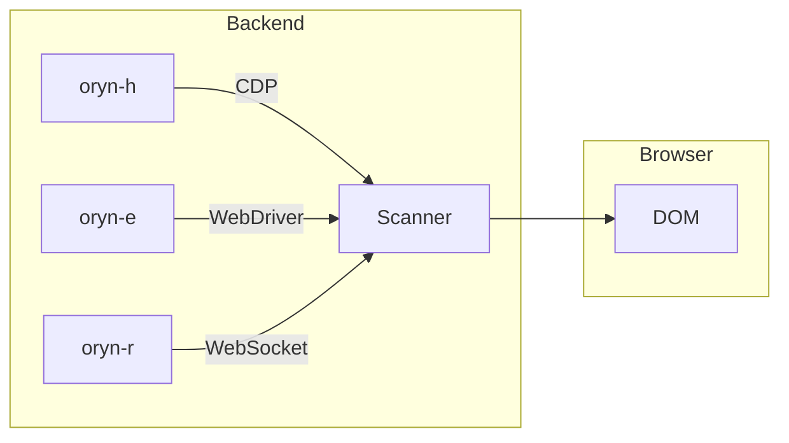

# Scanner Protocol

The Universal Scanner Protocol defines the interface between Oryn backends and the JavaScript scanner that runs inside web browsers.

## Overview

The scanner is the architectural keystone of Oryn. All three backends inject the identical JavaScript into their browser contexts, guaranteeing consistent behavior.

### Design Goals

| Goal | Description |
|------|-------------|
| **Universality** | Same protocol across WebKit, Chromium, and browser extensions |
| **Completeness** | Handles all element types, actions, and edge cases |
| **Efficiency** | Minimal data transfer, incremental updates |
| **Debuggability** | Clear errors, predictable structure |

### Architecture



## Message Format

### Request Structure

```json
{
  "cmd": "command_name",
  // command-specific parameters
}
```

### Response Structure

```json
{
  "ok": true,
  "data": {
    // command-specific response data
  },
  "timing": {
    "start": 1234567890,
    "end": 1234567891
  }
}
```

### Error Response

```json
{
  "ok": false,
  "error": "Error message",
  "code": "ERROR_CODE"
}
```

## Commands

### scan

Scan the page and return all interactive elements.

**Request:**

```json
{
  "cmd": "scan",
  "max_elements": 200,
  "include_hidden": false,
  "viewport_only": false
}
```

**Response:**

```json
{
  "ok": true,
  "data": {
    "page": {
      "url": "https://example.com/login",
      "title": "Sign In",
      "viewport": { "width": 1920, "height": 1080 },
      "scroll": { "x": 0, "y": 0, "maxX": 0, "maxY": 500 }
    },
    "elements": [
      {
        "id": 1,
        "type": "input",
        "role": "email",
        "tag": "input",
        "text": "Email address",
        "selector": "#email",
        "xpath": "//input[@id='email']",
        "rect": { "x": 100, "y": 200, "width": 300, "height": 40 },
        "attributes": { "type": "email", "required": true },
        "state": { "visible": true, "enabled": true, "focused": false }
      }
    ],
    "patterns": {
      "login_form": {
        "email": 1,
        "password": 2,
        "submit": 3
      }
    },
    "meta": {
      "total_scanned": 150,
      "interactive_found": 10,
      "scan_time_ms": 45
    }
  }
}
```

### click

Click an element by ID.

**Request:**

```json
{
  "cmd": "click",
  "id": 5,
  "button": "left",
  "click_count": 1,
  "force": false,
  "scroll_into_view": true
}
```

**Response:**

```json
{
  "ok": true,
  "data": {
    "action": "click",
    "target": { "id": 5, "selector": "#submit-btn" },
    "coordinates": { "x": 450, "y": 300 },
    "navigation_triggered": true
  }
}
```

### type

Type text into an element.

**Request:**

```json
{
  "cmd": "type",
  "id": 1,
  "text": "user@example.com",
  "clear": true,
  "delay": 0
}
```

**Response:**

```json
{
  "ok": true,
  "data": {
    "action": "type",
    "target": { "id": 1 },
    "text": "user@example.com",
    "final_value": "user@example.com"
  }
}
```

### select

Select an option in a dropdown.

**Request:**

```json
{
  "cmd": "select",
  "id": 3,
  "value": "option1"
}
```

**Response:**

```json
{
  "ok": true,
  "data": {
    "selected_value": "option1",
    "selected_text": "Option 1",
    "previous_value": "option2"
  }
}
```

### scroll

Scroll the viewport or a container.

**Request:**

```json
{
  "cmd": "scroll",
  "direction": "down",
  "amount": 500,
  "behavior": "instant"
}
```

**Response:**

```json
{
  "ok": true,
  "data": {
    "scroll_position": { "x": 0, "y": 500 },
    "max_scroll": { "x": 0, "y": 2000 }
  }
}
```

### wait_for

Wait for a condition to be true.

**Request:**

```json
{
  "cmd": "wait_for",
  "condition": "visible",
  "selector": "#success-message",
  "timeout": 30000
}
```

**Response:**

```json
{
  "ok": true,
  "data": {
    "condition_met": true,
    "wait_time_ms": 1500
  }
}
```

### execute

Execute arbitrary JavaScript.

**Request:**

```json
{
  "cmd": "execute",
  "script": "return document.title;",
  "args": []
}
```

**Response:**

```json
{
  "ok": true,
  "data": {
    "result": "Page Title"
  }
}
```

## Element Classification

### Types

| Type | Description |
|------|-------------|
| `input` | Text input, email, password, tel, url, number |
| `button` | Button elements and input type=button/submit |
| `link` | Anchor elements with href |
| `select` | Dropdown/select elements |
| `textarea` | Multi-line text input |
| `checkbox` | Checkbox inputs |
| `radio` | Radio button inputs |
| `generic` | Other interactive elements |

### Roles

Roles are inferred from type attributes, autocomplete hints, labels, and context:

| Role | Detection Signals |
|------|-------------------|
| `email` | type=email, autocomplete=email, label contains "email" |
| `password` | type=password, autocomplete=*password |
| `search` | type=search, role=search, label contains "search" |
| `tel` | type=tel, autocomplete=tel |
| `url` | type=url, label contains "website/url" |
| `username` | autocomplete=username, label contains "username" |
| `submit` | type=submit, button in form context |

### Modifiers

| Modifier | Meaning |
|----------|---------|
| `required` | Field is required |
| `disabled` | Element is disabled |
| `readonly` | Input is read-only |
| `hidden` | Element is hidden |
| `primary` | Primary/prominent action |
| `checked` | Checkbox/radio is checked |
| `focused` | Element has keyboard focus |

## Pattern Detection

The scanner automatically identifies common UI patterns:

### Login Form

```json
{
  "login_form": {
    "email": 1,
    "password": 2,
    "submit": 3,
    "remember": 4
  }
}
```

### Search Form

```json
{
  "search_form": {
    "input": 5,
    "submit": 6
  }
}
```

### Cookie Banner

```json
{
  "cookie_banner": {
    "container": "#cookie-notice",
    "accept": 7,
    "reject": 8
  }
}
```

### Pagination

```json
{
  "pagination": {
    "prev": 10,
    "next": 11,
    "pages": [12, 13, 14, 15]
  }
}
```

## Error Codes

| Code | Description | Recovery Strategy |
|------|-------------|-------------------|
| `ELEMENT_NOT_FOUND` | Element ID doesn't exist | Run `scan` to refresh |
| `ELEMENT_STALE` | Element removed from DOM | Run `scan` to refresh |
| `ELEMENT_NOT_VISIBLE` | Element exists but hidden | Scroll or wait |
| `ELEMENT_DISABLED` | Element is disabled | Wait for enabled state |
| `ELEMENT_NOT_INTERACTABLE` | Cannot interact (covered) | Use `force` option |
| `SELECTOR_INVALID` | CSS selector syntax error | Fix selector |
| `TIMEOUT` | Operation timed out | Increase timeout |
| `NAVIGATION_ERROR` | Navigation failed | Check URL/network |
| `SCRIPT_ERROR` | JavaScript execution error | Check script syntax |

## Element Map Lifecycle

### Map Creation

When `scan` is called:
1. Previous element map is cleared
2. DOM is traversed for interactive elements
3. New IDs are assigned sequentially
4. Element references are stored

### Map Staleness

The element map becomes stale when:
- Page navigation occurs
- DOM is modified by JavaScript
- AJAX updates content

### Best Practices

- Always scan before starting a new task
- Re-scan after navigation
- Re-scan after actions that modify content
- Don't cache element IDs across page loads
