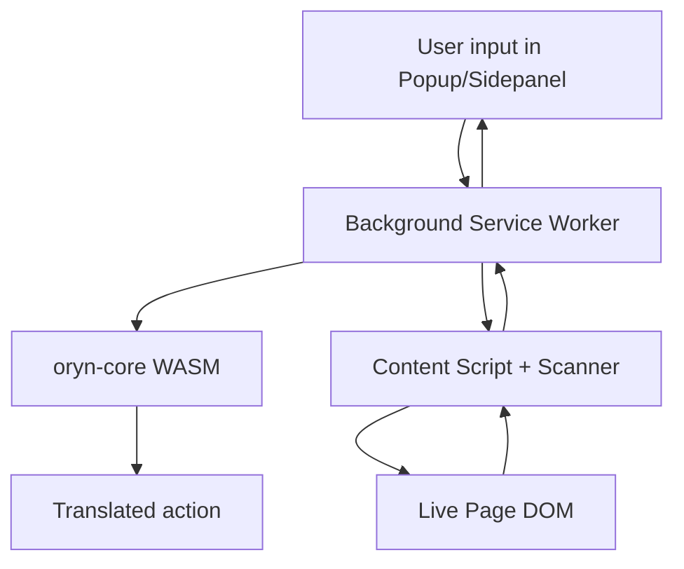

# Oryn-W Architecture

Oryn-W is a browser-native runtime composed of extension pages, a background service worker, content scripts, and the WASM module.

## High-Level Flow



## Main Components

### Background Service Worker (`background.js`)

- Central coordinator for command execution.
- Handles message types (execution, scanning, LLM, agent, trajectory ops).
- Owns LLM manager lifecycle and agent orchestration.

### WASM Module (`extension-w/wasm/*`)

- Built from `crates/oryn-core` via `wasm-pack`.
- Parses/normalizes/translates OIL.
- Returns action payloads consumed by background execution.

### Content Scripts (`scanner.js`, `content.js`, `suppress_alerts.js`)

- Injected on matched pages.
- Collect page state and interactive elements.
- Execute translated actions against the page.

### UI Layers (`popup.*`, `sidepanel.*`, `ui/*`)

- Popup for quick command dispatch.
- Sidepanel for richer logs, status, and agent mode.
- Configuration surfaces for LLM/wizard flows.

## Message-Oriented Contract

Common request families in background handlers:

- OIL execution and scan state:
  - `execute_oil`, `scan_complete`, `get_status`, `format_scan`
- LLM operations:
  - `llm_status`, `llm_get_adapters`, `llm_set_adapter`, `llm_prompt`, `llm_stream`
- Agent operations:
  - `execute_agent`, `agent_status`
- Trajectory operations:
  - `trajectory_get_all`, `trajectory_delete`, `trajectory_clear`, `trajectory_export`, `trajectory_import`, `trajectory_stats`

## Adapter and Agent Architecture

- `LLMManager` registers multiple adapters and detects availability.
- Adapter initialization can be deferred for service worker-safe startup.
- `RalphAgent` uses:
  - LLM prompts
  - observation loop via scanner
  - command execution via background
  - trajectory retrieval for few-shot context

## Scanner Source of Truth

- Canonical source: `crates/oryn-scanner/src/scanner.js`
- Synced targets:
  - `extension/scanner.js`
  - `extension-w/scanner.js`

Always sync after scanner changes:

```bash
./scripts/sync-scanner.sh
```
